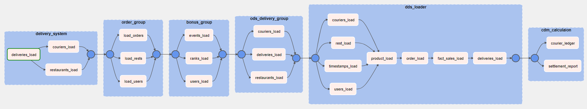

### Prerequiments
Для создание схемы, таблиц, и данных единоразово выполняется requiments.sql

### Важное дополнение
В объем документации входит только разработки, выполненные в ходе проекта. Тем не менее даны общие пояснения, которые затрагивают предыдущую реализацию. 

### Описание разработки
Загрузка данных реализована через единый пайплайн pipeline_dag в файле pipline_dag.py \
\
Архитектура хранилища данных представляет по слойное хранение:
-   stg - данные систем-источников
-   ods - преобразованные данных исходных систем
-   dds - корпоративная модель данных
-   cdm - информационные витрины

Загрузка данных из систем-источников реализована в виде группы, которые последовательное объединены в общий pipeline, согласно логике зависимости справочных данных.

Слой ods построен только для системы источника по доставкам (delivery), предыдущая реализация хранилища в части систем бонусов и заказов не предусматривала ODS слой.

DDS слой единый с учетом зависимости между сущностями. \

На слое CDM рассчитаваются витрины, включая новую витрину проекта dm_courier_ledger.

Новые таблицы проекта

| **Таблица**                    | **Описание сущности**                 | **Таска**                           | **Режим обновления**          |
|--------------------------------|---------------------------------------|-------------------------------------|-------------------------------|
| stg.deliverysystem_couriers    | Данные курьеров из системы доставки   | delivery_system.couriers_load       | Полный                        |
| stg.deliverysystem_deliveries  | Данные доставок из системы доставки   | delivery_system.deliveries_load     | Полный                        |
| stg.deliverysystem_restaurants | Данные ресторанов из системы доставки | delivery_system.restaurants_load    | Полный                        |
| ods.deliverysystem_couriers    | Данные курьеров из системы доставки   | ods_delivery_group.couriers_load    | Полный                        |
| ods.deliverysystem_deliveries  | Данные доставок из системы доставки   | ods_delivery_group.deliveries_load  | Полный                        |
| ods.deliverysystem_restaurants | Данные ресторанов из системы доставки | ods_delivery_group.restaurants_load | Полный                        |
| dds.fct_delivery               | Данные доставок                       | dds_loader.deliveries_load          | Инкрементальный по updated_ts |
| dds.dm_couriers                | Данные курьеров из системы доставки   | dds_loader.couriers_load            | Инкрементальный по updated_ts |
| cdm.dm_courier_ledger          | Данные отчета для платежей курьеру    | cdm_calculaion.courier_ledger       | Полный                        |

### Вспомогательные даги:
Для новых сущностей с целью независимого тестирования и отладки были реализованы отдельные даги с меткой test.

### Структура репозитория
Реализация каждого слоя хранилища находится в соответствующем каталоге, который дополнительно может быть разбит на подкатлоги по системе источника. Непосредcвенные действия с данными реализованы в файлах с маской `<...loader.py>`, реализация груп и тасков - в файла c маской `<...group.py>`. В катлоге `lib` находится общие классы для всего проекта.

### Общая логика обработки данных
Обработка данных реализована по принципу ELT: данные извлекаются и записываются операторами airflow, преобразоавния полностью осуществляется SQL внутри DWH. Обработка данных операторами внутри airflow полностью исключена.